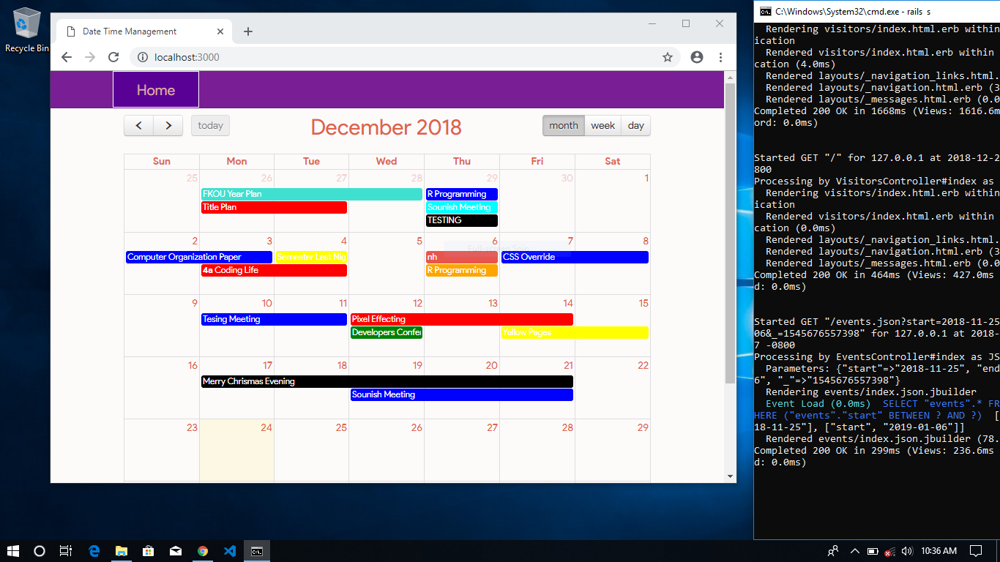
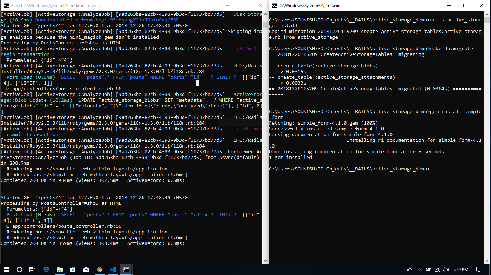

## Event Schedular Rails App

This is very nice clean and clear rails event management app, which comes with built-in features with  
- ### Drag and Drop features
    Here I've a done tweak in between having the cool features on dragging and dropping the event scheduling app, while we can easily manipulate the events easily.

`Here a photo over here, where it explaines the all things...righly`

 

- ### Nice UI Designed

The UI was coded and build with self experimental issues.
I want to design button corretly though it looks little bit more decent.

- ### Rails serving controller routes

    Here's the picture of rails server up and running.
    and the databases flows.

- ### MVC Pattern Control Flow

MVC pattern has been used to manipulate the all 
``Model View Controller`` Architecture.

#### To generate model events
        rails generate mdoel events

#### To generate controller visitor root
        rails generate scaffold visitors

#### Routes
        root to: "visitors#index"